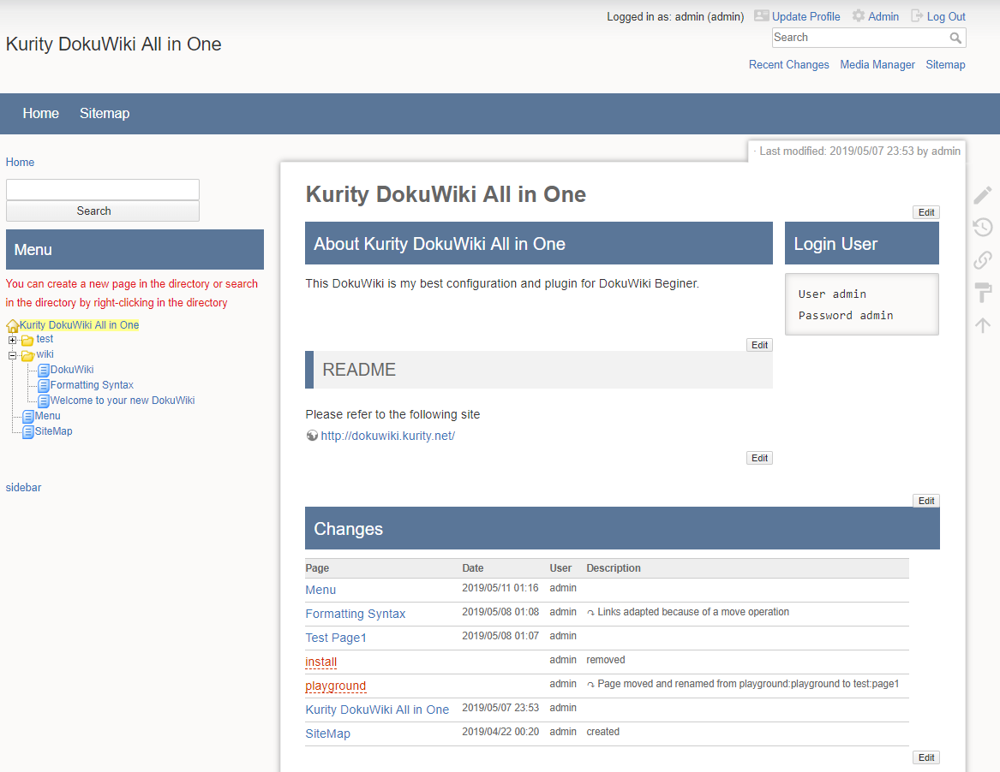

# Kurity DokuWiki Template

## About Kurity DokuWiki Template
Kurity DokuWiki Template has some modifications of the DokuWiki's default template.

https://dokuwiki.kurity.net/template/

## Screenshots
#### Screenshot1

## Installation
If you install this template manually, make sure it is installed in
`lib/tpl/kurity/` - if the folder is called different it
will not work!

Please refer to https://www.dokuwiki.org/template for additional info
on how to install templates in DokuWiki.